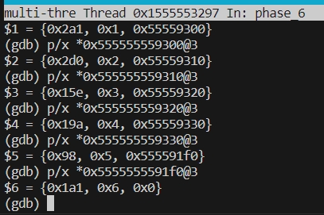

## Bomb 实验报告

### phase_1 解题思路

```asm
0000000000001419 <phase_1>:
    1419:	48 83 ec 08          	sub    $0x8,%rsp
    141d:	48 8d 35 2c 1d 00 00 	lea    0x1d2c(%rip),%rsi        # 3150 <_IO_stdin_used+0x150>
    1424:	e8 25 05 00 00       	callq  194e <strings_not_equal> # 比较传入的两个参数 %rdi 和 %rsi 
    1429:	85 c0                	test   %eax,%eax
    142b:	75 05                	jne    1432 <phase_1+0x19>
    142d:	48 83 c4 08          	add    $0x8,%rsp
    1431:	c3                   	retq   
    1432:	e8 17 06 00 00       	callq  1a4e <explode_bomb>
    1437:	eb f4                	jmp    142d <phase_1+0x14>
```

`strings_not_equal` 函数比较的是 `%rdi` 和 `%rsi` 表示的两个字符串是否相同，其中输入的字符串为 `%rdi`。使用

```bash
x/s $rsi
```

可得到目标串 `Border relations with Canada have never been better.`。

### phase_2 解题思路

在读入之前，查看 `sscanf` 的第二个参数 `%rsi` 可得知，题目要求按照 `%d %d %d %d %d %d` 的格式读入 $6$ 个数字。

```asm
    1447:	83 3c 24 00          	cmpl   $0x0,(%rsp)
    144b:	75 07                	jne    1454 <phase_2+0x1b>
    144d:	83 7c 24 04 01       	cmpl   $0x1,0x4(%rsp)
	1452:	74 05                	je     1459 <phase_2+0x20>
```

这两行说明第一个数字和第二个数字必须分别为 $0$ 和 $1$。

在之后的过程中，`%rbx` 指向的是当前要考虑的数，`%eax` 表示当前数之前所有数的和，`%rbp` 是数列末尾。每一次 `%rbx` 会向后挪动 `0x4` 指向下一个数，将挪动后指向的数累加进 `%eax`，比较挪动后的数的下一个数是否等于 `%eax`。此时每一次验证的 `%eax`，本质上是 **检查当前元素之前的元素和是否等于当前元素**。这样答案满足斐波那契数列的形式，为 `0 1 1 2 3 5`。 

### phase_3 解题思路

查看 `sscanf` 的第二个参数 `%rsi` 得知，题目要求按照 `%d %c %d` 的格式读入$2$ 个数字和一个字符。由

```asm
    14ad:	83 7c 24 0c 07       	cmpl   $0x7,0xc(%rsp)
    14b2:	0f 87 09 01 00 00    	ja     15c1 <phase_3+0x13d>
```

知第一个数字的大小不能超过 $7$，且由于下一命令为 `ja`，所以第一个数字是非负整数。我尝试的是 $0$。

```asm
    14c3:	48 63 04 82          	movslq (%rdx,%rax,4),%rax
    14c7:	48 01 d0             	add    %rdx,%rax
    14ca:	ff e0                	jmp    *%rax
```

这是一个 `switch` 语句的结构，我进入第一个数字为 $0$ 所对应的分支后，发现它没有加密之后的比较。程序直接明文比较了我的字符是否为 `t`，第二个数是否为 $60$。因此答案为 `0 t 60`。

### phase_4 解题思路

题目要求读入两个数。

由

```asm
    1662:	83 7c 24 08 04       	cmpl   $0x4,0x8(%rsp)
    1667:	74 05                	je     166e <phase_4+0x54>
```

发现第二个参数必须为 $4$。再次观察，由

```asm
    163e:	83 7c 24 0c 0e       	cmpl   $0xe,0xc(%rsp)
    1643:	76 05                	jbe    164a <phase_4+0x30>
```

发现第 $1$ 个数必须不大于 $14$。发现 `func4` 是一个自己会调用自己的递归函数。设 `func4(x, y, z)`，则

```asm
    15e1:	89 d0                	mov    %edx,%eax
    15e3:	29 f0                	sub    %esi,%eax				# %eax 存 z - y
    15e5:	89 c1                	mov    %eax,%ecx				# %ecx 存 z - y
    15e7:	c1 e9 1f             	shr    $0x1f,%ecx				# %ecx 存 z - y 的符号位
    15ea:	01 c1                	add    %eax,%ecx
    15ec:	d1 f9                	sar    %ecx						# 和右移 1
    15ee:	01 f1                	add    %esi,%ecx				# 加上 y
```

上述代码做的其实是 **两个有符号整数的和除以二**，即 `%ecx` 中存储的是 `(y + z) / 2`。

不难推出 `func4` 的表示形式：

```c
int func4(int x, int y, int z) {
    if (x < (y + z) / 2)
        return 2 * func4(x, y, (y + z) / 2 - 1);
   	if (x > (y + z) / 2)
        return 2 * func4(x, y, (y + z) / 2 + 1) + 1;
    return 0;
}
```

由于 `phase_4` 中比较的是 `func4` 的返回值和 $4$ 是否相等：

```asm
    165d:	83 f8 04             	cmp    $0x4,%eax
    1660:	75 07                	jne    1669 <phase_4+0x4f>
```

且 `phase_4` 调用的是 `func4(x, 0, 14)`，其中 $x$ 为输入的第一个数。要想返回 $4$，那么必须按照这样的路径调用 `func4`：

```c
func4(x, 0, 14) = 2 * func4(x, 0, 6) = 4 * func4(x, 0, 3) = 4 * (func4(x, 0, 2) + 1) = 4
```

且最后一次 `func4(x, 0, 2)` 需要返回 $0$。则必有 $x = 2$。因此答案为 `2 4`。

### phase_5 解题思路

题目要求输入一个字符串。

```asm
    16b4:	48 8d 35 fc 1a 00 00 	lea    0x1afc(%rip),%rsi        # 31b7 <_IO_stdin_used+0x1b7>
    16bb:	e8 8e 02 00 00       	call   194e <strings_not_equal>
```

在 `string_not_equal` 之前查看 `%rsi` 发现目标字符串为 `sabres`。但直接输入 `sabres` 炸弹仍然会爆炸，因为前面几行实际上是在对输入字符串进行加密。

```asm
    168a:	48 8d 0d 4f 1b 00 00 	lea    0x1b4f(%rip),%rcx        # 31e0 <array.0>
```

此时输入 `x/s $rcx` 会得到字符串 `maduiersnfotvbyl`。

事实上，

```asm
    1691:	0f b6 14 03          	movzbl (%rbx,%rax,1),%edx		# %edx 存输入串中当前字符
    1695:	83 e2 0f             	and    $0xf,%edx				# 取末四位
    1698:	0f b6 14 11          	movzbl (%rcx,%rdx,1),%edx		# 在 maduiersnfotvbyl 找对应【偏移量】
    169c:	88 54 04 09          	mov    %dl,0x9(%rsp,%rax,1)
    16a0:	48 83 c0 01          	add    $0x1,%rax
    16a4:	48 83 f8 06          	cmp    $0x6,%rax
    16a8:	75 e7                	jne    1691 <phase_5+0x1e>
```

这是一个循环，其中 `%rax` 为进行迭代的变量，当 `%rax` 为 $6$ 的时候说明长度刚好为 $6$，结束。每次在 `maduiersnfotvbyl` 中找对应当前字符末四位对应的偏移量，即 `a->1, b->2, c->3, ..., o->15`。

`sabres` 在 `maduiersnfotvbyl` 中下标的位置为 `103, 97, 109, 102, 101, 103`，输出 ASCII 码对应的字符得到答案 `gamfeg`。

### phase_6 解题思路

题目要求输入 $6$ 个数字。

根据对代码的分析可以得出，内存中存有 $6$ 个结构体，每个结构体包括 $3$ 个部分（两个整数和一个地址），构成了一个链表。题目要求根据我们输入的 $6$ 个数字，用 $7$ 减去它得到的差的顺序对第一个整数进行排序，结果是从大到小的。

由于代码中提示了

```asm
    174a:	48 8d 15 9f 3b 00 00 	lea    0x3b9f(%rip),%rdx        # 52f0 <node1>
```

所以我们可以直接顺着读出整个链表：



然后按照第一个数从大到小排序，分别输出 $7$ 减去第二个数的值即可。答案为 `5 6 1 3 4 2`。

### 感想、吐槽、新的实验设计

#### 感想

这次实验让我印象最深刻的一点是，`phase_5` 中使用到了 `a` 的 ASCII 码末四位恰好为 `0001`，所以 `&0xf` 后末四位不变，刚好对应字母在字母表中的排名。我觉得这一定是当时 ASCII 表的设计者有意为之，将 `a` 的 ASCII 码设置为 $97=64+32+1$，然后才考虑其他不可见字符，排列在 $0 \sim 96$。

我觉得这次实验锻炼了我阅读汇编代码的能力，至少我现在能背诵清楚 `%rdi %rsi %rdx %rcx %r8 %r9` 的顺序了；这次实验也让我对 GDB 这一调试工具掌握得更加熟练。

#### 吐槽

`phase_4` 发现第一个数不大于 $14$ 之后就可以枚举破解，而且最后发现 `secret_phase` 的答案不大于 $32$ 之后也可以试出答案。~~这是不是可以不劳而获（~~

#### 新的实验设计

```asm
func100:							# 有 3 个参数：%ecx %edx %r8d
	pushq	%rbp
	movq	%rsp, %rbp
	movl	%ecx, 16(%rbp)
	movl	%edx, 24(%rbp)
	movl	%r8d, 32(%rbp)
	movl	16(%rbp), %eax
	idivl	24(%rbp)
	movl	32(%rbp), %eax
	addl	%edx, %eax
	popq	%rbp
	ret
```

我觉得添加一个取模运算会让这个实验变得很有意思，这个函数是

```c
int func100(int x, int y, int z) {
    return x % y + z;
}
```
