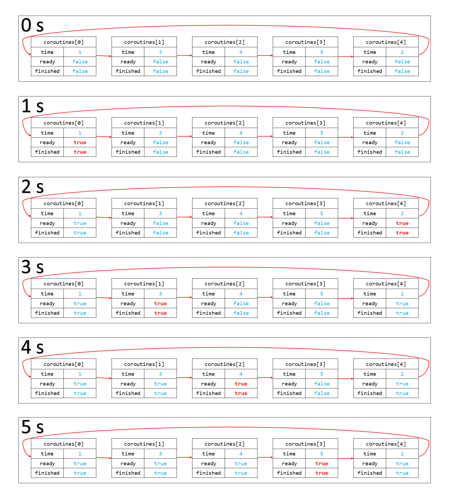
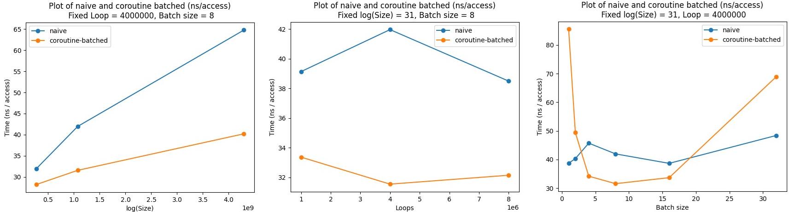

## Coroutine 实验报告

### Task 1: 协程库的编写

#### 代码实现

`common.h`:

```cpp
void yield() {
  if (!g_pool->is_parallel) {
    // 从 g_pool 中获取当前协程状态
    auto context = g_pool->coroutines[g_pool->context_id];
    // 调用 coroutine_switch 切换到 coroutine_pool 上下文
    coroutine_switch(context->callee_registers, context->caller_registers);
  }
}
```

`context.h`:

```cpp
virtual void resume() {
  // 调用 coroutine_switch
  // 在汇编中保存 callee-saved 寄存器，设置协程函数栈帧，然后将 rip 恢复到协程 yield 之后所需要执行的指令地址。
  coroutine_switch(caller_registers, callee_registers);
}
```

`context.S`:

```assembly
.global coroutine_entry
coroutine_entry:
    movq %r13, %rdi
    callq *%r12

.global coroutine_switch
coroutine_switch:
    # TODO: Task 1
    # 保存 callee-saved 寄存器到 %rdi 指向的上下文
    movq %rsp, 64(%rdi)
    movq %rbx, 72(%rdi)
    movq %rbp, 80(%rdi)
    movq %r12, 88(%rdi)
    movq %r13, 96(%rdi)
    movq %r14, 104(%rdi)
    movq %r15, 112(%rdi)
    # 保存的上下文中 rip 指向 ret 指令的地址（.coroutine_ret）
    # 由于 movq 指令不能直接对两个内存进行操作，所以需要用一个寄存器（例如 %rax）当“中转站”
    leaq .coroutine_ret(%rip), %rax
    movq %rax, 120(%rdi)
    # 从 %rsi 指向的上下文恢复 callee-saved 寄存器
    movq 64(%rsi), %rsp
    movq 72(%rsi), %rbx
    movq 80(%rsi), %rbp
    movq 88(%rsi), %r12
    movq 96(%rsi), %r13
    movq 104(%rsi), %r14
    movq 112(%rsi), %r15
    # 最后 jmpq 到上下文保存的 rip
    jmpq *120(%rsi)

.coroutine_ret:
    ret
```

#### 1. 协程切换时栈的变化过程


#### 2. 解释协程是如何执行的

```cpp
basic_context(uint64_t stack_size)
    : finished(false), ready(true), stack_size(stack_size) {
  // 分配“堆栈”空间
  stack = new uint64_t[stack_size];

  // TODO: Task 1
  // 在实验报告中分析以下代码
  // 在“堆栈”中获取“栈顶指针”对应的地址，称为 rsp
  uint64_t rsp = (uint64_t)&stack[stack_size - 1];
  // 对齐到 16 字节边界
  rsp = rsp - (rsp & 0xF);
  // 对函数进行声明
  void coroutine_main(struct basic_context * context);
  // 首先把栈顶指针正确存储
  callee_registers[(int)Registers::RSP] = rsp;
  // 协程入口是 coroutine_entry，函数将从 RIP 开始执行
  callee_registers[(int)Registers::RIP] = (uint64_t)coroutine_entry;
  // 设置 r12 寄存器为 coroutine_main 的地址
  callee_registers[(int)Registers::R12] = (uint64_t)coroutine_main;
  // 设置 r13 寄存器，用于 coroutine_main 的参数
  // coroutine_main 的唯一参数为一个上下文结构体的指针，所以应该被赋值为当前上下文结构体的 this 指针
  callee_registers[(int)Registers::R13] = (uint64_t)this;
}
```

观察 `context.S` 中的 `.coroutine_entry`：

```assembly
.global coroutine_entry
coroutine_entry:
	# 设置参数
    movq %r13, %rdi
    # 调用函数
    callq *%r12
```

它将 `%r13` 作为接下来调用的函数的参数（赋值给了 `%rsi`），接着直接调用了 `%r12` 中的函数。因此我们应该将 `coroutine_main` 的地址赋值给 `%r12`，将 `this` 赋值给 `%r13`。

```cpp
void coroutine_main(struct basic_context *context) {
  // 对于每一个协程对应的上下文而言，首先运行它
  // 虽然这个过程中，可能会被调度器切换到另一个协程
  // 但当那个协程运行完之后，一定会切换回当前协程，最终完成运行
  context->run();
  // 运行完成之后，将其标记为“已完成”
  context->finished = true;
  // 再将控制权交还给调度器
  coroutine_switch(context->callee_registers, context->caller_registers);
  // 所以以下部分的代码是不会被执行的
  // unreachable
  assert(false);
}
```

#### 3. 浮点和向量寄存器的协程切换

*System V Application Binary Interface AMD64 Architecture Processor Supplement(With LP64 and ILP32 Programming Models) Version 1.0* 中提到：

> This subsection discusses usage of each register. Registers `%rbp`, `%rbx` and `%r12` through `%r15` “belong” to the calling function and the called function is required to preserve their values.  

这说明只有 `%rbp`，`%rbx`，`%r12~%r15` 为 callee-saved 类型的寄存器，在协程切换时需要被备份。

在 *Computer Systems: A Programmer's Perspective(Third Edition)* 中也提到，浮点和向量寄存器 **要么作为函数调用时的参数进行传递，要么作为 caller-saved 类型的寄存器**。因此在协程切换时，它们都不需要进行备份。

### Task 2: 实现 sleep 函数

#### 代码实现

`common.h`:

```cpp
void sleep(uint64_t ms) {
  if (g_pool->is_parallel) {
    auto cur = get_time();
    while (
        std::chrono::duration_cast<std::chrono::milliseconds>(get_time() - cur)
            .count() < ms)
      ;
  } else {
    // 从 g_pool 中获取当前协程
    auto context = g_pool->coroutines[g_pool->context_id];
    // 将其设置为不可用状态
    context->ready = false;
    // 获取当前时间，更新 ready_func
    auto cur = get_time();
    // ready_func：检查当前时间，如果已经超时，则返回 true
    context->ready_func = [cur, ms]() {
      return std::chrono::duration_cast<std::chrono::milliseconds>(get_time() - cur)
            .count() >= ms;
    };
    // 调用 coroutine_switch 切换到 coroutine_pool 上下文
    coroutine_switch(context->callee_registers, context->caller_registers);
  }
}
```

`coroutine_pool.h`:

```cpp
void serial_execute_all() {
  is_parallel = false;
  g_pool = this;

  int len = coroutines.size();
  
  while (true) {
    // currentSize 表示当前还剩多少个协程函数没有完成
    int currentSize = len;
    // 进行轮询
    for (int i = 0; i < len; i++) {
      // 如果当前协程函数还没有完成
      if (!coroutines[i]->finished) {
        // 如果当前协程函数还没有准备好，那么就调用 ready_func()，看它能不能准备好
        if (!coroutines[i]->ready)
          coroutines[i]->ready = coroutines[i]->ready_func();
        // 如果当前协程函数准备好了，那么就继续它
        if (coroutines[i]->ready) {
          // 设置上下文 id
          context_id = i;
          // 继续
          coroutines[i]->resume();
        }
      }
      // 如果当前协程函数完成了，就将 currentSize 自减 1
      if (coroutines[i]->finished)
        currentSize--;
    }
    // 如果所有协程函数都完成了，就结束
    if (!currentSize)
      break;
  }

  for (auto context : coroutines) {
    delete context;
  }
  coroutines.clear();
}
```

#### 1. `sleep_sort` 中不同协程的运行情况

假设对 `1 3 4 5 2` 进行排序：



#### 2. 协程库更高效的实现方式

由于每一次轮询需要遍历每个协程检查是否已完成，这样会占用较多时间，因此我们可以考虑维护一个由 **未完成** 的协程构成的链表，这样就不用浪费时间去访问已经被完成的协程了。

```cpp
void serial_execute_all() {
  is_parallel = false;
  g_pool = this;

  int len = coroutines.size();

  std::list<std::pair<int, basic_context *> > clist;
  // 初始化链表
  for (int i = 0; i < len; i++)
    clist.push_back(std::make_pair(i, coroutines[i]));

  // 当链表非空时：
  while (!clist.empty()) {
    // 只轮询未完成的协程
    for (auto it = clist.begin(); it != clist.end(); ) {
      int id = it->first;
      basic_context * context = it->second;
      if (!context->finished) {
        if (!context->ready)
          context->ready = context->ready_func();
        if (context->ready) {
          context_id = id;
          context->resume();
        }
      }
      auto nxt = ++it;
      // 如果当前轮询已完成，则将其从链表中删除
      if (context->finished)
        clist.erase(--it);
      it = nxt;
    }
  }

  for (auto context : coroutines) {
    delete context;
  }
  coroutines.clear();
}
```

### Task 3: 利用协程优化二分查找

#### 代码实现

`binary_search.cpp`:

```cpp
void lookup_coroutine(const uint32_t *table, size_t size, uint32_t value,
                      uint32_t *result) {
  size_t low = 0;
  while ((size / 2) > 0) {
    size_t half = size / 2;
    size_t probe = low + half;

    // TODO: Task 3
    // 使用 __builtin_prefetch 预取容易产生缓存缺失的内存
    __builtin_prefetch(&table[probe]);
    // 并调用 yield
    yield();

    uint32_t v = table[probe];
    if (v <= value) {
      low = probe;
    }
    size -= half;
  }
  *result = low;
}
```

#### 汇报性能的提升效果

采用控制变量法，探讨 log(Size), Loops 和 Batch size 对于协程优化的性能影响：固定其他两个量的同时，测量唯一可变量对 naive 算法和 coroutine-batched 算法的影响。



1. **结论**：在大部分数据上提升效果较为明显

    这是因为，在处理大量数据时，二分查找可能会导致大量的缓存缺失，从内存读取数据到 CPU 需要耗费大量的 CPU 周期。为了优化二分查找，可以利用协程的特性。优化的方法是，修改二分查找中容易导致缓存缺失的代码，通过使用预取指令来异步地让 CPU 读取数据，然后使用 `yield` 来切换到其他协程。

    通过这种方式，我们可以充分利用协程的并发性和异步性质，使得CPU在等待数据读取的同时可以执行其他协程的任务，从而提高整体的效率。这种优化方法可以在处理大规模数据集时显著减少缓存缺失的影响，并提升程序的性能。

2. 与 log(Size) 间的关系、与 Loops 间的关系

    由图 1 和图 2 可知，无论这两者进行怎样的改变，都能使协程优化后的二分查找效率更高。这说明它们不是最关键的因素。

3. 与 Batch size 间的关系

    由图 3 可知，Batch size 过小或过大，都会导致协程优化后的二分查找效率更低。

    具体来说：Batch size 较小时，prefetch 是没有意义的，因为多次（但每次少量）的 prefetch 导致的性能开销甚至超过将数据提前放入缓存对性能的增益。当 Batch size 过大时，单次 prefetch 得到的 batch 并没有被有效地使用，较多的数据被闲置，这导致每次加载到 CPU 缓存中的数据过多，有很多的数据被加载了但未被及时访问。这也会导致性能降低。

### 参考资料

1. *[System V Application Binary Interface AMD64 Architecture Processor Supplement(With LP64 and ILP32 Programming Models) Version 1.0](https://gitlab.com/x86-psABIs/x86-64-ABI)*
2. *Computer Systems: A Programmer's Perspective, Page 204-205*
3. *[Interleaving with Coroutines: A Practical Approach for Robust Index Joins](https://dl.acm.org/doi/pdf/10.14778/3149193.3149202)*

### 总结和感想

在完成这个实验的过程中，我学到了很多关于协程和计算机系统的知识。通过编写协程库和实现相关功能，我对协程的概念和工作原理有了更深入的理解。

在完成 Task 1 时，我实现了协程库的基本功能，并进行了测试。画协程切换时栈的变化过程，让我对协程的运行过程有了更清晰的认识。在 Task 2 和 Task 3 中我也对现有的代码尝试进行了优化（虽然有的时候测试结果看起来不太成功），用链表/预取命令让自己的程序跑得更快——在做此次实验前我完全不理解这些。在完成实验的过程中，我也与同学进行了交流，讨论了协程的实现细节和优化方法。

总的来说，这个实验对我来说是一个很有挑战性的任务，但通过完成实验，我加深了对计算机系统和协程的理解。虽然代码很短，没怎么提升自己的编程能力，但我仍然收获颇丰，十分喜欢这个实验。
